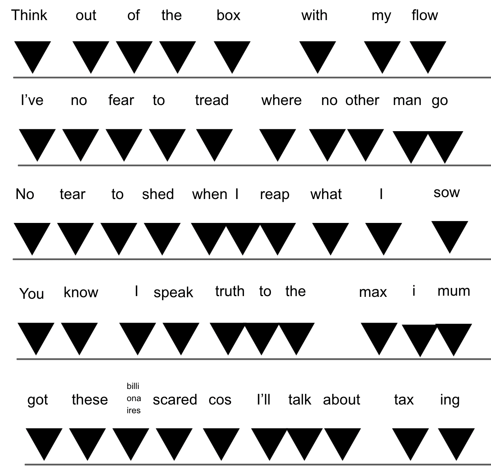

# ICCC25

The evaluation is limited to the question; <b> does the AI output sound like the ground truth example? </b>

### Audio data: ground truth example

The ground truth auduo represents the voice, cadence and rhyme scheme that the various Text To Speech (TTS) models attempt to emulate.

  

### Text data samples

Text samples below are used by TTS to generate rap. The outputs (flow) are then compared to the audio sample. 

### 1. Freestyle rap sample-1 (from audio)  

Think out the box with my flow  
I've no fear to tread where no other man go,  
No tear to shed when I reap what I sow  
You know I speak truth  to the maximum,   
Got these billionaires scared, cos I talk about taxing  

---

### 2. Freestyle rap sample-2 (approximates flow of original)

I break all the rules with my flow
 
I plant every seed and I watch it all grow
 
No chains on my feet, I’m ready to go
 
I speak what I see, let the whole world know
 
These suits start to sweat cos they'll never scare me  

---

### 3. Eminem ‘Lose Yourself’

His palms are sweaty, knees weak, arms are heavy  
There's vomit on his sweater already, mom's spaghetti  
He's nervous, but on the surface, he looks calm and ready  
To drop bombs, but he keeps on forgetting  
What he wrote down, the whole crowd goes so loud  

---

